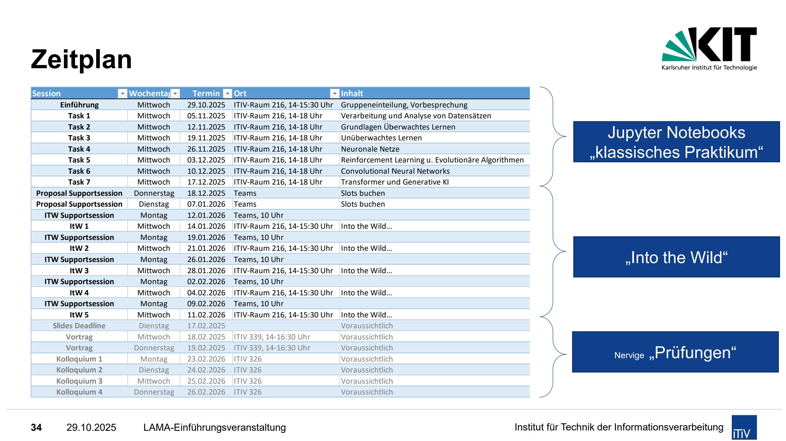

# ITW-Mazerunner
Reinforcement learning based system to steer a ball on a tilting plate.


# Kurzanleitung

## Installation

### 1. Repository klonen
```bash
git clone <repository-url>
cd <repository-directory>
```

### 2. Virtuelles Environment aktivieren
```bash
source .venv/bin/activate
```

### 3. Dependencies installieren
```bash
pip install -r requirements.txt
```

## Workflow bei neuen Dependencies

Wenn du eine neue Library installierst:

```bash
pip install <package-name>
```

**Wichtig:** Aktualisiere die `requirements.txt`:
```bash
pip freeze > requirements.txt
```

Committe die aktualisierte `requirements.txt` ins Repository:
```bash
git add requirements.txt
git commit -m "Add/Update dependencies"
```

---

## Tips

- Stelle sicher, dass du immer in einem aktivierten Virtual Environment arbeitest (Prompt sollte `(.venv)` anzeigen)
- Nutze WSL2 für beste Performance
- Halte `requirements.txt` immer auf dem aktuellen Stand


# Projektplan


## Woche bis 18.01.26
- Aufbau einer simulation
- Testaufbau mit gymnasium
- Darstellung des Environments
- MVP mit Stable Baseline agent
-> beide machen alles und wir fusionieren das gelernte

## Woche bis 25.01.26
- Erweiterung der Simulation mit 3D TM3 oder Mujoco bzw. PyBullet
- RL Modell Konzeption und aufbau
- Optimierung für Training
- Grundlagenresearch

## Woche bis 01.02.26
- RL Agent trainieren und parameter optimieren
- Hardware Modellieren / Bauen
- Bilderkennung

## Woche bis 08.02.26
- Hardwareintegration
- Training auf der Hardware

## Woche bis 15.02.26
- Optimierung von Parametern
- Abgabeslides erstellen
- Zeitpuffer